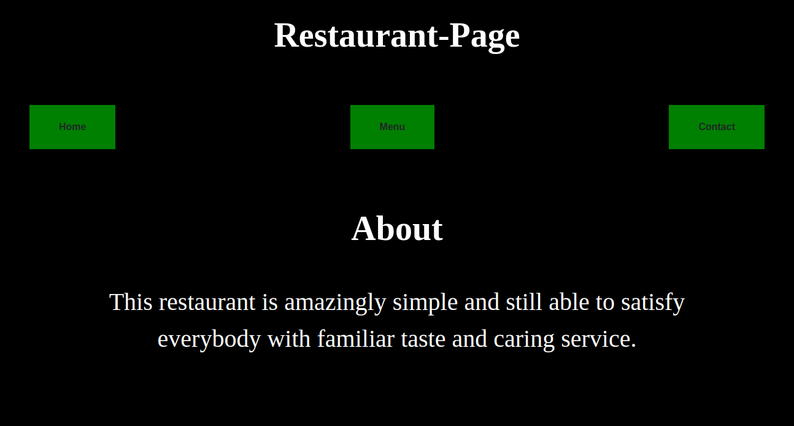

# Restaurant-Page

> A simple website created to use different tabs to navigate. This was created in order to test ES6 functionality. Modules are import and export with JavaScripts default.

## Built

- Javascript
- HTML 5
- Bootstrap

## Live Demo

[Live Demo]()

## Getting Started

To get a local copy up and running follow these simple example steps.

### Prerequisites

- A browser
- Text Editor

### Setup

**STEP 1**
In the terminal, Run the following commands.

- `git clone git@github.com:Jarfsoft/Restaurant-Page.git`
- `cd Restaurant-Page`

OR

- Download the zip file form `https://github.com/Jarfsoft/Restaurant-Page`

**STEP 2**

- Then open the `index.html` file from the `dist` folder using a browser.
- Enjoy the simple restaurant website.

## Author

👤 **Juan Andrés Raudales**

- GitHub: [@Jarfsoft](https://github.com/Jarfsoft)
- Twitter: [@Jarfsoft](https://twitter.com/Jarfsoft)
- LinkedIn: [Juan Andrés Raudales Flores](https://www.linkedin.com/in/juan-raudales-flores-7b0a3b113/)

## 🤝 Contributing

Contributions, issues and feature requests are welcome!

Feel free to check the [issues page](https://github.com/Jarfsoft/Restaurant-Page/issues).

## Show your support

Give a ⭐️ if you like this project!

## 📝 License

This project is [MIT](https://opensource.org/licenses/MIT) licensed.